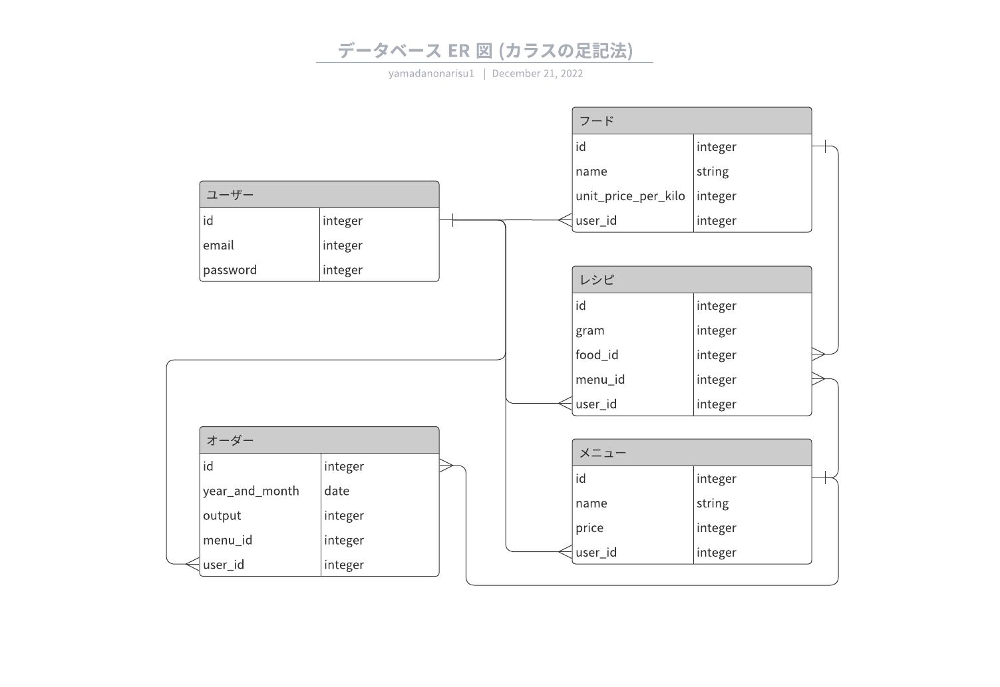

## アプリケーション名　
「コストマネージメント」
## アプリケーション概要  
メニューの理論上の原価を計算するアプリです。
## URL
https://cryptic-waters-39450.herokuapp.com/
## ログインアカウント
yamadanonarisu@gmail.com
111111
## 技術スタック
Rails 7.0.4  
ruby 2.7.6  
devise
## 利用方法
1. メール認証による会員登録をします。  
2. 食材登録より、食材名とキログラムの単価を入力します。食材一覧で登録食材が確認できます。  
3. メニュー登録より、メニュー名と価格を入力します。こちらもメニュー一覧で確認ができます。  
4. メニュー一覧のメニュー詳細からレシピ登録ができます。登録した食材を選択し、使用グラム数を入力します。  
5. 月間種数管理ページの月間出数新規登録より、年月と出数を入力します。  

マイページに登録メニューの・原価率・販売数・原価・売上・粗利益・構成比などが表示されます。  
また、検索より任意の月のデータを表示することができます。
## 目指した課題解決
飲食関係の方が、実際の原価率とメニューによる原価率を比べその差異によるロスなど原価圧迫の把握ができればと思い作成しました。
## データベース設計

## 工夫した点、大変だった点
メニューの出数登録を一括登録にした方が便利だと考え、フォームを作成しましたがなかなか上手くいかず苦戦しました。  
デバックツールを使いparamsやcontrollerの動きを追いながら作成しました。  
また、中間テーブルであるrecipeの取り扱いや登録foodの合計値を呼び出したりをすることで、  
モデルについての理解を深くできたと感じました。
